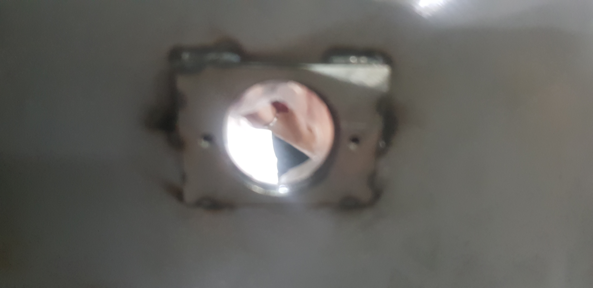
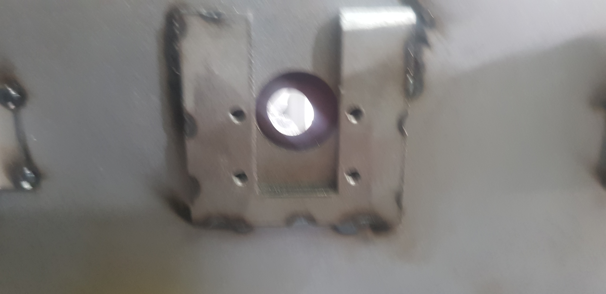
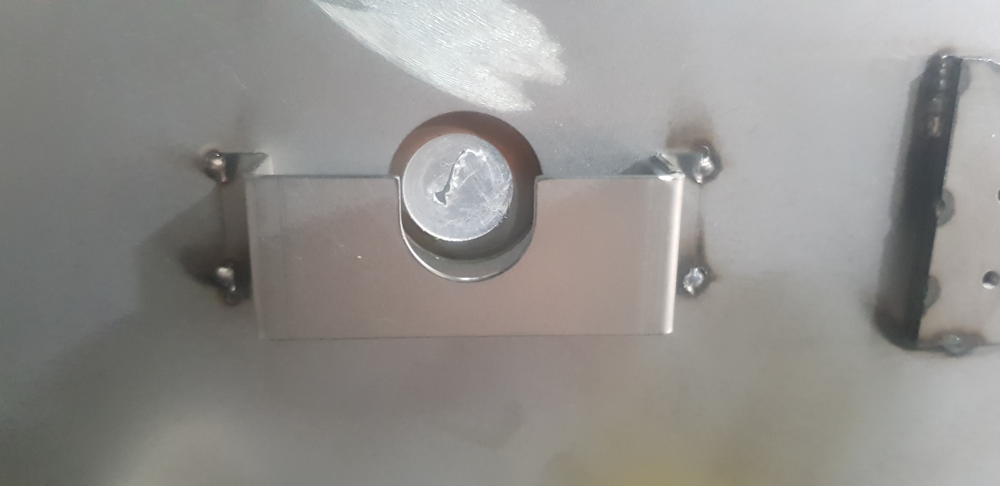
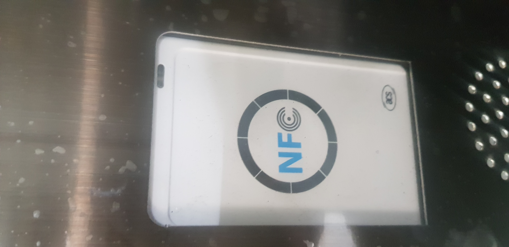
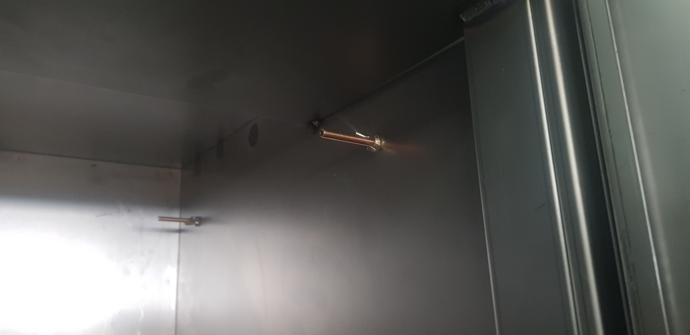

1.  pir 센서 견착
  현재 3 mm 로 타공이 되어 있어 2.6 mm 로 변경
  
  
3.  카메라 모듈 견착
  180 도로 회전. 타공 2.6 mm 로 변경
  
  
5.  마이크 견착
  견착이 안되어 있는 전면 수정(어떻게 할지는 모름)
    
    
7.  rfid 카드

  가운데 정렬이 되지 않아 타공 크기를 더 작게 만들어 달라고 요청함
    
    
10.  프린트
  프린트 체결 방법 변경(ㄷ자로 체결)
  
12.  등기함 선 내리는 문제
   메인함 내에 구명을 뜷어 선 내리게 편하도록 
13. 등기함이 전체적으로 닫기가 부자연스러움
   
15.  모니터 
    가운데 정열이 되지 않았음
17.  앙카
  설치후 마감에 대한 대비를 해야할것 같음
  
18.  보관함 열사이 체결 나사
  엔터정밀에서 사용한 나사 이용해야 할것 같음 
      
      
21.  오른쪽 가이드 보관함 문이 걸리는 문제 
  가드 보관함 사이 간격   7mm  늘린다 함
  
20. 메인함 내에 선 빼내는 구명이 너무 작아 현장에서 타공함

22. 전체 도색이 되지 않은 상태임
